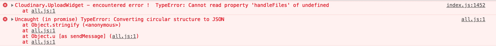

Cloudinary widget in react
--------------------------

This project was bootstrapped with [Create React App](https://github.com/facebook/create-react-app)

Two examples of the cloudinary widget in react

WidgetModal.js shows the pop up modal version
WidgetInline.js show the th widget attached to the DOM

I had a problem with using the inlineContainer setting

If you use this 👇 the widget will load befroe the redner and cause you error

```jsx
 inlineContainer: document.getElementById('myWidgetContainer'),
```

And it sort of gets halfway, it sort of mounts like the modal but stays grey and these error in the console



--------------------------

FIXME: simply put the div #id in a string and you shouldn't have any problems
```jsx
  inlineContainer: '#myWidgetContainer'
```

I get the function to launch the widget
```jsx
componentDidMount() {
        this.uploadWidget() 
    }
```
