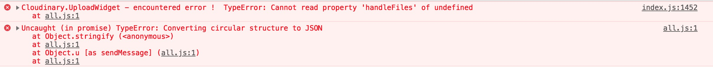

Cloudinary widget in react
--------------------------

This project was bootstrapped with [Create React App](https://github.com/facebook/create-react-app)

----------------------------------------------------------------------------------------------------

Two examples on with the pop-up modal, one trying to get the widget inline

The component WidgetModal.js shows how I have integrated the widget to be run on a button click And that works fine

Un-comment the component App.js/WidgetInline.js to see what happens when I add the widget attr - inline container

```jsx
 inlineContainer: document.getElementById('myWidgetContainer'),

```

I get the function to launch the widget

```jsx
componentDidMount() {
        this.uploadWidget() 
    }
```

And it sort of gets halfway, it sort of mounts like the modal but stays grey and these error in the console



I tried using [React.createRef()](https://reactjs.org/docs/refs-and-the-dom.html) to try grab the DOM element but no joy there

Any advice, improvements on either method would be great

